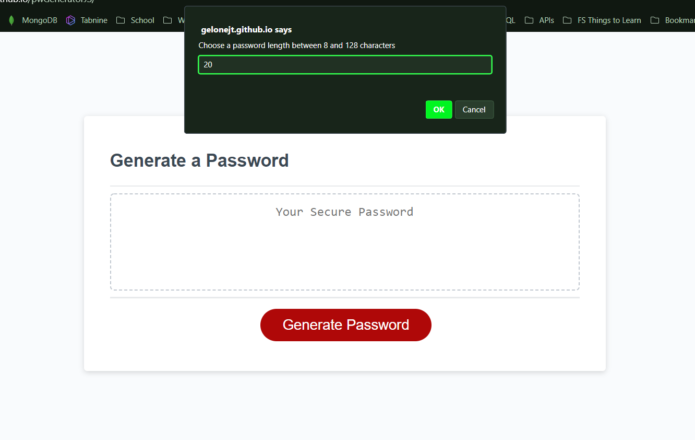
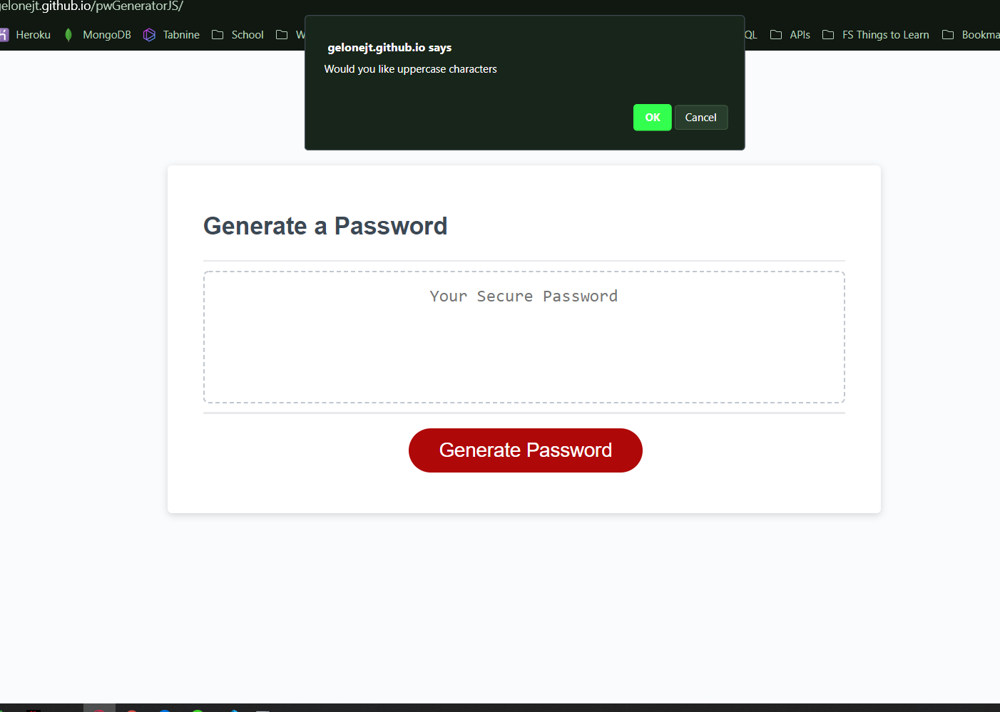
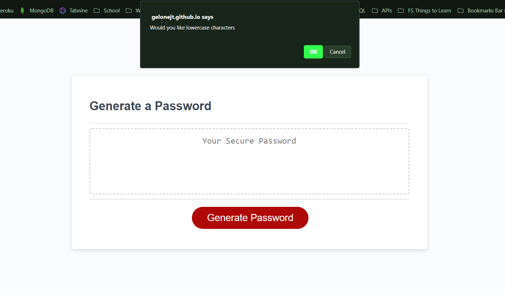
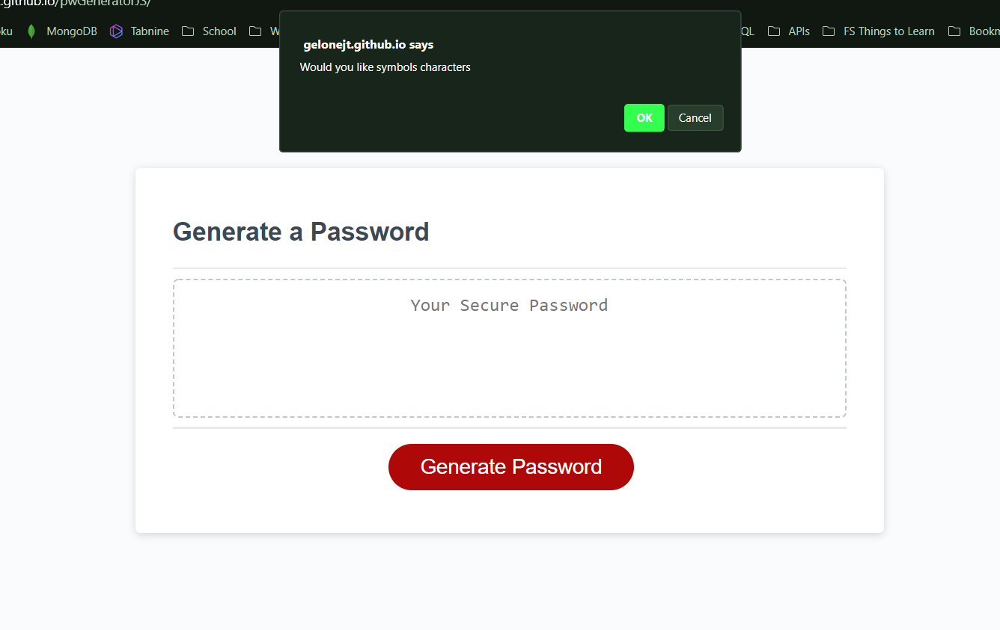
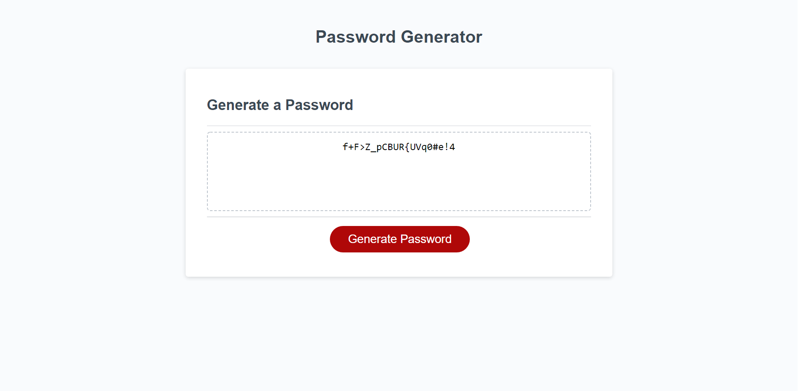

# Password Generator

  ## Description
  The purpose of this application is provide the user with the abillity to generate a randomized password based on questions presented to them which include: desired password length, with or without upper case and/or lowercase letters, numerical characters, and special characters. Using this generator will allow the user to generate up to 1.429702652 E+12 possible combinations based on their input parameters.

  ## Table of contents
  - [Installation](#installation)
  - [Usage](#usage)
  - [Credit](#credit)
  - [Tests](#tests)
  - [GitHub](#github)
  - [Email](#email)
  - [Questions](#questions)
  - [License](#license)

  ## Installation

  No installation is needed to use this web based application. A link is provided in this repository for use or this code can be forked for personal use and alteration.

  ## Usage
  Launch the application in a brower of your choosing for use.

## `Below is an example if 20 characters is selected with every character option.`

  
  
  
  
  
  

  

  ## Credit
  Jelani Thomas

  ## Tests
  No tests included

  ## GitHub
  GeloneJT

  ## Email
  jelani13@icloud.com

  ## Questions
  To reach me in regards to this repo or any others reach out to me via the GitHub or email provided above.

  ## License
  
